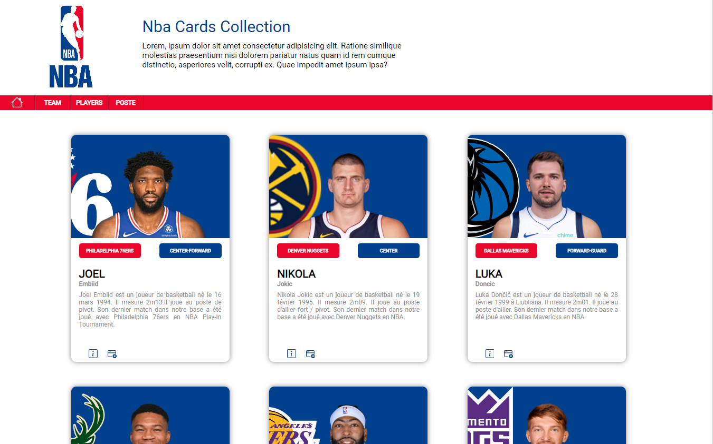

# The Collection NBA Cards

## Purpose

This project serves as an exercise to practice working with HTML and CSS for layout and styling, as well as basic JavaScript concepts such as the Document Object Model (DOM). By completing this project, learners will gain hands-on experience in manipulating the DOM with JavaScript to create dynamic and interactive web applications.

## Instructions

The link to the instructions is available [here](https://github.com/becodeorg/CRL-KELLER-7/tree/main/2.PROJECTS/2.TheCollection).

## Languages Used

- HTML and CSS
- JavaScript Basics
- The DOM
- Sass

## Responsive?

Yes, the site is responsive!

## Screenshots

You can view the project result on GitHub Pages [here](https://ludoviclacroix82.github.io/TheCollection/).

### Source

The images and descriptions are sourced from [NBA.com](https://www.nba.com/).
